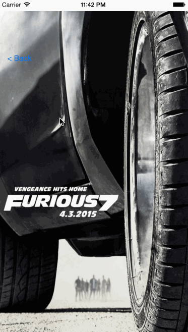

## Rotten Tomatoes

This is a movies app displaying box office and top rental DVDs using the [Rotten Tomatoes API](http://developer.rottentomatoes.com/docs/read/JSON).

Time spent: 6.5 hours

### Features

#### Required

- [x] User can view a list of movies. Poster images load asynchronously.
- [x] User can view movie details by tapping on a cell.
- [x] User sees loading state while waiting for the API.
- [ ] User sees error message when there is a network error: http://cl.ly/image/1l1L3M460c3C
- [x] User can pull to refresh the movie list.

#### Optional

- [ ] All images fade in.
- [ ] For the larger poster, load the low-res first and switch to high-res when complete.
- [ ] All images should be cached in memory and disk: AppDelegate has an instance of `NSURLCache` and `NSURLRequest` makes a request with `NSURLRequestReturnCacheDataElseLoad` cache policy. I tested it by turning off wifi and restarting the app.
- [ ] Customize the highlight and selection effect of the cell.
- [x] Customize the navigation bar.
- [x] Add a tab bar for Box Office and DVD.
- [x] Add a search bar: pretty simple implementation of searching against the existing table view data.

Notes:
Got stuck on adding touch support on grid views, and pass correct index of each grid cell.
Waste a lot of time trying to reuse the same view controller and custom table cell class, probably should use xib file ?
Autolayout sucks, wasted lots of time on it this afternoon.

### Walkthrough

Credits
---------
* [Rotten Tomatoes API](http://developer.rottentomatoes.com/docs/read/JSON)
* [AFNetworking](https://github.com/AFNetworking/AFNetworking)
